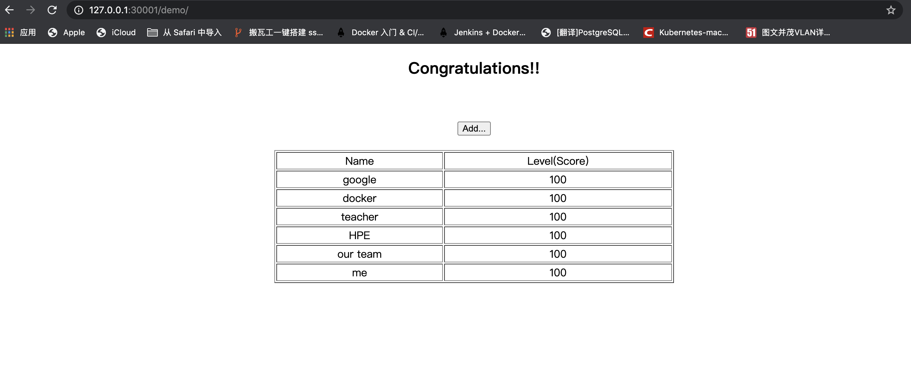

- 从一个文件创建一个rc资源
```
kubectl create -f mysql-rc.yaml --validate=false
```
这里我之前不成功，对比了源码才看出来，labels写成了lables.
- 查看所有的pod
```
kubectl get pod
```
显示结果
```text
NAME                                READY   STATUS    RESTARTS   AGE
mysql-grpjp                         1/1     Running   0          5d1h
nginx-deployment-7b45d69949-7tkjq   1/1     Running   1          24d
nginx-deployment-7b45d69949-dzlwl   1/1     Running   1          24d
nginx-deployment-7b45d69949-pz9xl   1/1     Running   1          24d
nginx-deployment-7b45d69949-xv97g   1/1     Running   1          24d
```
对，你没有看错，都跑了很久了，是因为之前mysql镜像因为很大拉不下来，网络问题很无奈，我只好让它慢慢下
然后下着下着就忘记了。
- 查看单个pod的状态
因为这个pod的类型是replicationController,缩写是rc
所以通过类型看下
```text
kubectl get rc
```
但我们还是关注下这个pod的详细状态
```text
kubectl describe pod mysql-grpjp
```
看看显示结果
```text
Name:         mysql-grpjp
Namespace:    default
Priority:     0
Node:         docker-desktop/192.168.65.3
Start Time:   Sun, 25 Oct 2020 18:57:43 +0800
Labels:       app=mysql
Annotations:  <none>
Status:       Running
IP:           10.1.0.43
IPs:
  IP:           10.1.0.43
Controlled By:  ReplicationController/mysql
Containers:
  mysql:
    Container ID:   docker://0390f97fc0d334c731f30428eeec26295b053b95c106155ef8765389e513283e
    Image:          mysql
    Image ID:       docker-pullable://mysql@sha256:8c17271df53ee3b843d6e16d46cff13f22c9c04d6982eb15a9a47bd5c9ac7e2d
    Port:           3306/TCP
    Host Port:      0/TCP
    State:          Running
      Started:      Tue, 27 Oct 2020 18:39:58 +0800
    Ready:          True
    Restart Count:  0
    Environment:
      MYSQL_ROOT_PASSWORD:  123456
    Mounts:
      /var/run/secrets/kubernetes.io/serviceaccount from default-token-cbr49 (ro)
Conditions:
  Type              Status
  Initialized       True 
  Ready             True 
  ContainersReady   True 
  PodScheduled      True 
Volumes:
  default-token-cbr49:
    Type:        Secret (a volume populated by a Secret)
    SecretName:  default-token-cbr49
    Optional:    false
QoS Class:       BestEffort
Node-Selectors:  <none>
Tolerations:     node.kubernetes.io/not-ready:NoExecute for 300s
                 node.kubernetes.io/unreachable:NoExecute for 300s
Events:          <none>
```
- 查看docker容器
```text
docker ps | grep mysql
```
我们可以看到两个容器
```text
0390f97fc0d3        mysql                    "docker-entrypoint.s…"   3 days ago          Up 3 days                               k8s_mysql_mysql-grpjp_default_67619d03-0e95-4f9f-85c0-b4ead4ddf2cb_0
f54ea8a1a5a0        k8s.gcr.io/pause:3.2     "/pause"                 5 days ago          Up 5 days                               k8s_POD_mysql-grpjp_default_67619d03-0e95-4f9f-85c0-b4ead4ddf2cb_0
```
这里可以注意到一个细节，就是我当时创建mysql容器是5天前，但是我的mysql docker容器 才运行3天。
这个pause容器已经运行5天了，这是pod的根容器。一个pod的实际容器可能当时会由于某些原因起不来，
但是跟容器一定会马上起来，并且根容器的启动时间会代表这个pod的实际运行时间。
- 创建一个service
创建明亮
```text
# kubectl create -f mysql-svc.yaml
service/mysql created
```
然后通过命令查看刚刚创建的service
```text
# kubectl get svc
NAME         TYPE        CLUSTER-IP     EXTERNAL-IP   PORT(S)    AGE
kubernetes   ClusterIP   10.96.0.1      <none>        443/TCP    25d
mysql        ClusterIP   10.96.184.12   <none>        3306/TCP   28s
```
可以看到mysql服务被分配了一个10.96.0.1的ClusterIp地址，其他pod就可以通过这个地址+端口来访问它了

- 创建tomcat pod
```text
# kubectl create -f myweb-rc.yaml
replicationcontroller/myweb created
```
在对myweb-rc.yaml的github源码查看的时候，发现和书本上记录的不一样，暂时还不明白意思，先写书本上的把

- 创建tomcat的对应的service
```text
#  kubectl create -f myweb-svc.yaml 
service/myweb created
```
yaml文件的里边的type=NodePort 和 nodePort=30001的两个属性表面此service开启了NodePort方式
的外网访问模式（对应到8080的虚端口上）

- 再看看service的情况
```text
# kubectl get svc
NAME         TYPE        CLUSTER-IP      EXTERNAL-IP   PORT(S)          AGE
kubernetes   ClusterIP   10.96.0.1       <none>        443/TCP          25d
mysql        ClusterIP   10.96.184.12    <none>        3306/TCP         35m
myweb        NodePort    10.106.22.122   <none>        8080:30001/TCP   3m16s
```
- 通过浏览器访问
我们通过输入 http://10.96.0.1:30001/demo/ 看看,发现无法访问。问题就来了，令人头大，是哪里出了问题呢？
后来我发现，原来ip是要本机器的ip ，
输入以后发现 报错了
```text
Error:com.mysql.jdbc.exceptions.jdbc4.MySQLNonTransientConnectionException: Could not create connection to database server.
```
这让我想起书上的代码和源码不一致的地方,我改成和源码一致的时候，
```text
        env:
        - name: MYSQL_SERVICE_HOST
          value: 'mysql'
        - name: MYSQL_SERVICE_PORT
          value: '3306'
```
再执行
```text
docker replace -f myweb-rc.yaml
```
当我重新访问的时候，还是一样的错误，
我看github源码上的[!issue](https://github.com/kubeguide/K8sDefinitiveGuide-V4-Sourcecode/issues/7)说是因为mysql连接的jar包版本太低，而mysql版本太高为8.0
那我们就进去一探究竟。
- 首先我们看看tomcat容器的数据库jar包
先看tomcat容器
```text
# docker ps | grep tomcat
11f454750b27        kubeguide/tomcat-app     "catalina.sh run"        20 hours ago        Up 20 hours                             k8s_myweb_myweb-vmsm5_default_ccc32636-a8a3-4012-9c8c-878be821036d_0
ae5268a2649b        kubeguide/tomcat-app     "catalina.sh run"        20 hours ago        Up 20 hours                             k8s_myweb_myweb-wlvvw_default_e87ef90a-6343-4191-8c8d-df59132e8db8_0
```
然后进到一个容器中
```text
# docker exec -it ae5268a2649b /bin/bash
```
cd 到目录/usr/local/tomcat/webapps/demo/WEB-INF/lib
果然发现lib里边的jar包为 mysql-connector-java-5.1.37.jar
- 再看看mysql的版本
先看mysql容器
```text
# docker ps | grep mysql
0390f97fc0d3        mysql                    "docker-entrypoint.s…"   3 days ago          Up 3 days                               k8s_mysql_mysql-grpjp_default_67619d03-0e95-4f9f-85c0-b4ead4ddf2cb_0
f54ea8a1a5a0        k8s.gcr.io/pause:3.2     "/pause"                 5 days ago          Up 5 days                               k8s_POD_mysql-grpjp_default_67619d03-0e95-4f9f-85c0-b4ead4ddf2cb_0
```
进入到mysql容器
```text
# docker exec -it 0390f97fc0d3 /bin/bash
```
登陆mysql
```text
# mysql -uroot -p123456
Welcome to the MySQL monitor.  Commands end with ; or \g.
Your MySQL connection id is 11
Server version: 8.0.22 MySQL Community Server - GPL

Copyright (c) 2000, 2020, Oracle and/or its affiliates. All rights reserved.

Oracle is a registered trademark of Oracle Corporation and/or its
affiliates. Other names may be trademarks of their respective
owners.

Type 'help;' or '\h' for help. Type '\c' to clear the current input statement
```
可以看到，确实如网友提的issue所说，版本都对上了。那行，我们改。
- 更改mysql版本
```
# kubectl edit pod  mysql-grpjp
```
修改里边的spec.containers.image 的值 为 mysql:5.7
保存后就OK了，等到pod重启我们再访问一下
 到这，第一个demo完成了。
- 后续
但是还存在一些问题，就是env参数为啥要改成那样呢 ？哪样，我拷贝下
```text
        - name: MYSQL_SERVICE_HOST
          value: 'mysql'
        - name: MYSQL_SERVICE_PORT
          value: '3306'
```
我觉得这应该是应用程序里边有通过代码去获取这两个参数
于是我再次通过上边说过的方法，进入到了容器，看到了index.jsp里边的代码
```text
String ip=System.getenv("MYSQL_SERVICE_HOST");
String port=System.getenv("MYSQL_SERVICE_PORT");
```
好的，确实是这样，验证完毕，第一个demo到此结束